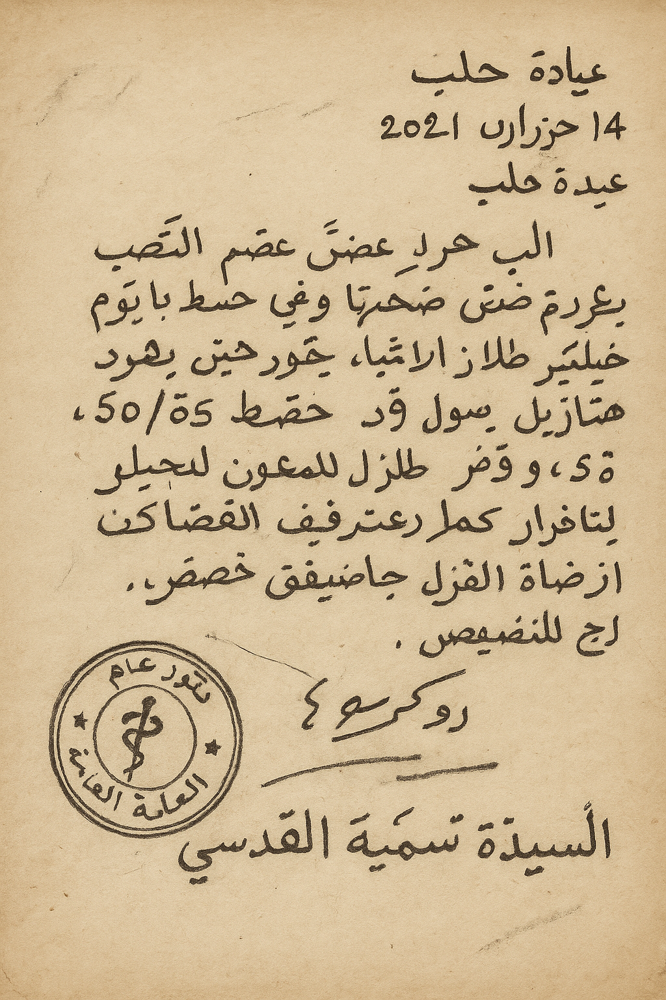

# Medical Passport

This project aims to build a fully functional medical passport system with OpenAI’s [OSS models](https://openai.com/index/introducing-gpt-oss/), [Model Context Protocol (MCP)](https://modelcontextprotocol.io/specification/2025-06-18), and Google’s [Agent-to-Agent Protocol (A2A)](https://a2a-protocol.org/dev/specification/). The goal is to build an agentic AI system that can take handwritten or scanned patient notes, digitize them with OCR, translate them across languages, map them into structured [FHIR/HL7](https://www.hl7.org/fhir/) data, summarize with key clinical risks, and generate bilingual referral packets.

This is designed to address a pressing issue faced by organizations like [Médecins Sans Frontières](https://www.msf.org/): patients often have fragmented, paper-based, multilingual records that disrupt continuity of care, especially when crossing borders or moving between clinics. By combining specialized autonomous agents with shared tools and interoperable communication, and by relying on open-source AI models that can run offline in remote or resource-limited settings, the project will demonstrate how agentic AI can make patient information more reliable, portable, and accessible where it is needed most.

In practice, this could mean a patient arriving with only a messy handwritten note having their medical information recorded into a structured, bilingual format that follows them across clinics. These records could be stored online in a standardized system, making it easier for different organizations and providers—even across borders—to access up-to-date patient information and coordinate care.


# 8/23/25 Update: MVP

After a week of wrestling with it, I’ve finally got something working end-to-end.

The system is now running as a real multi-agent pipeline via A2A protocol. Each stage of the workflow is encapsulated in its own agent, with the orchestrator coordinating the sequence and data handoff between them. This makes the pipeline modular: each agent publishes a clean JSON payload that downstream agents can consume, and the orchestrator enforces ordering and error handling. On top of this, the agents leverage shared MCP tools for OCR, translation, and structuring tasks, so their capabilities remain modular and interchangeable while still speaking a common protocol. While discovery is still card-based/static rather than emergent, the setup already demonstrates how independent services can negotiate responsibilities through shared standards. In practice, this means a handwritten note can trigger a cascade of specialized agents, each acting on the structured outputs of the last, until a fully bilingual referral packet is produced.

## Agents:

1. **Intake Agent** → OCR + language detection
2. **Translation Agent** → source → English (and back to patient's language)
3. **Structuring Agent** → map to FHIR-like Bundle (still need to integrate proper coding system)
4. **Summarizer Agent** → clinical summary + key risks
5. **Referral Agent** → generate PDF/TXT packets with localized summaries

An **Orchestrator Agent** coordinates these, ensuring data flows through the chain. All agents pull tools from a shared MCP server.

## Setting up locally

### 1) Install prereqs

* **Python 3.10+**
* **Tesseract OCR** (+ individal language packs beyond english)
   * macOS (Homebrew):

```bash
brew install tesseract
brew install tesseract-lang
```

   * Ubuntu/Debian:

```bash
sudo apt-get update
sudo apt-get install tesseract-ocr
sudo apt install tesseract-ocr-ara
```

### 2) Fonts

Default fonts currently included in `data/fonts/`:

* `data/fonts/NotoSans-Regular.ttf` — for Latin scripts (English, Spanish, French, etc.)
* `data/fonts/NotoNaskhArabic-Regular.ttf` — for Arabic, Urdu, Farsi, Pashto (RTL shaping)

These are TrueType fonts (TTF) from Google's [Noto project](https://fonts.google.com/noto). I plan on adding way more.

### 3) Environment variables

Create a `.env` at the repo root:

```bash
OPENAI_API_KEY="sk-...your key..."
OPENAI_MODEL="o4-mini" # goal is to switch to gpt-oss-20b offline
```

The agents expect these to be set for LLM-backed steps.

### 4) Virtual environment & dependencies

```bash
python3.10 -m venv .venv
source .venv/bin/activate

# Install pinned deps
pip install -r requirements.txt
```

### 5) Run the MCP server

```bash
export MCP_TRANSPORT=streamable-http
export MCP_HOST=127.0.0.1
export MCP_PORT=8000
export MCP_PATH=/mcp
python mcp_server.py
```

### 6) Kick off the workflow

This starts all agents and runs a sample:

(Arabic example)
```bash
python client.py launch data/samples/note_ar.jpg --locale ara --target en
```

(Spanish example)
```bash
python client.py launch data/samples/note_es.jpg --locale spa --target en
```

This will:

* Start all 5 sub-agents + orchestrator on their respective ports
* Pass a test Arabic/Spanish note through the workflow (you can test sample notes of your own, as long as the currently supported fonts can handle them)
* Output a referral PDF and TXT under `data/outputs/`

You can inspect each agent's metadata at:

```bash
curl http://127.0.0.1:41241/.well-known/agent-card.json | jq .
```
(replace port with respective agent)

## Next Steps:

While this MVP demonstrates a functioning chain, there are many areas for improvement:

### Quality

* **MCP Tools**: Make OCR + language detection more deterministic across noisy scans.
* **Prettier Packets**: Create a more professional looking final "passport".
* **FHIR Mapping**: Move from heuristic resource creation to real coding systems (SNOMED, LOINC, RxNorm).
* **Translation**: Support pluggable backends (ex: MarianMT, Argos Translate, or remote APIs) for robustness.

### Toward True Emergent Coordination

Right now, discovery is static: each agent's port is hardcoded, and orchestration assumes the skill belongs to a known service. Next iterations could enable:

* **Dynamic Skill Lookup**: Orchestrator queries AgentCards at runtime ("Who can `translate`?") instead of fixed URLs.
* **Fallback & Error Recovery**: If one translation agent fails, orchestration retries with another advertising the same skill.
* **Decentralized Queries**: Agents query each other directly without needing the orchestrator to micromanage.
* **Autonomous Negotiation**: Multiple agents decide who takes the task based on capabilities, confidence scores, or health.

### Platform + Scalability

* **User Interface**: Build a lightweight web UI so the system can be used beyond the CLI
* **Iterative Refinement**: Continuously validate against synthetic + real patient data.
* **Offline Functionality**: Run OCR/LLMs locally via OpenAI OSS models.
* **Expanded Fonts**: Add multilingual font support (CJK, Devanagari, Cyrillic).
* **Broader Language Coverage**: Expand to a much wider range of patient languages.

## Sample Run

### Sample Arabic Note:



### Real-time logs:

```bash
python client.py launch data/samples/note_ar.jpg --locale ara --target en
[launch] starting agents.intake_agent on :41241
[agents.intake_agent] INFO:     Started server process [18408]
[agents.intake_agent] INFO:     Waiting for application startup.
[agents.intake_agent] INFO:     Application startup complete.
[agents.intake_agent] INFO:     Uvicorn running on http://127.0.0.1:41241 (Press CTRL+C to quit)
[launch] agents.intake_agent ready on :41241
[launch] starting agents.translation_agent on :41242
[agents.translation_agent] INFO:     Started server process [18410]
[agents.translation_agent] INFO:     Waiting for application startup.
[agents.translation_agent] INFO:     Application startup complete.
[agents.translation_agent] INFO:     Uvicorn running on http://127.0.0.1:41242 (Press CTRL+C to quit)
[launch] agents.translation_agent ready on :41242
[launch] starting agents.structuring_agent on :41243
[agents.structuring_agent] INFO:     Started server process [18412]
[agents.structuring_agent] INFO:     Waiting for application startup.
[agents.structuring_agent] INFO:     Application startup complete.
[agents.structuring_agent] INFO:     Uvicorn running on http://127.0.0.1:41243 (Press CTRL+C to quit)
[launch] agents.structuring_agent ready on :41243
[launch] starting agents.summarizer_agent on :41244
[agents.summarizer_agent] INFO:     Started server process [18415]
[agents.summarizer_agent] INFO:     Waiting for application startup.
[agents.summarizer_agent] INFO:     Application startup complete.
[agents.summarizer_agent] INFO:     Uvicorn running on http://127.0.0.1:41244 (Press CTRL+C to quit)
[launch] agents.summarizer_agent ready on :41244
[launch] starting agents.referral_agent on :41245
[agents.referral_agent] INFO:     Started server process [18417]
[agents.referral_agent] INFO:     Waiting for application startup.
[agents.referral_agent] INFO:     Application startup complete.
[agents.referral_agent] INFO:     Uvicorn running on http://127.0.0.1:41245 (Press CTRL+C to quit)
[launch] agents.referral_agent ready on :41245
[launch] starting agents.orchestrator_agent on :41246
[agents.orchestrator_agent] INFO:     Started server process [18418]
[agents.orchestrator_agent] INFO:     Waiting for application startup.
[agents.orchestrator_agent] INFO:     Application startup complete.
[agents.orchestrator_agent] INFO:     Uvicorn running on http://127.0.0.1:41246 (Press CTRL+C to quit)
[launch] agents.orchestrator_agent ready on :41246
[launch] all agents ready

[client] calling Orchestrator…
[agents.orchestrator_agent]   client = A2AClient(agent_card=card, httpx_client=http)
[agents.intake_agent] [INFO] medicalpassport: [A2A] Intake Agent skill=run
[agents.intake_agent] Processing request of type ListToolsRequest
[agents.intake_agent] [INFO] medicalpassport: [MCP] Intake Agent -> ocr_image payload={"file_path": "data/samples/note_ar.jpg", "locale_hint": "ara"}
[agents.intake_agent] Processing request of type CallToolRequest
[agents.intake_agent] [INFO] medicalpassport: [MCP] Intake Agent <- ocr_image result_keys=['text', 'metadata']
[agents.intake_agent] [INFO] medicalpassport: [MCP] Intake Agent -> detect_language payload={"text": "الملاحظات الطبية - مستشفى حلب\nالاسم: السيدة سمية القدسي\n\nالعمر: 78 سنة\nالمكان: حلب؛ سوريا\n\nالشكوى الرئيسية: ألم في الصدر منذ ؟ أيام + صداح متكرر + إرهاق عام\n:التاريخ المرضي\n\nارتفاع ضغط الدم منذ © سنوات .»ا\n\n.حمى متقطعة الأسبوع الماضي ‎٠‏\n\nالا سكري ولا أمراض قلب ورائية .©\n\n:الفحص السريري\n8 مم زنيق إضغط الدم ©\nالنبض: 8/إدقيقة .©\nالتتفض: ‎١١‏ إدقيقة .©\nالقلب: أصوات طبيعية ‏ »\nالرئتان: واضحة؛ بدون صفير ©\nالبطن: لين بدون ألم ‎٠‏\n\nالخطة العلاجية:\n\nفحص إنزيمات القلب + 080 . 7\n\n. تصوير بدر بالأشعة\n\n*. باراسيتامول ‎50٠‏ مغ للصداع\n\n4. متابعة الضغط يوميا\n\n. مراجعة خلال أسبوع\n\nراحة + شرب ماء كاف »\n\nمراجعة طوارئ عند زيادة ألم الصدر أو دوار شديد ‏ »«\n"}
[agents.intake_agent] Processing request of type CallToolRequest
[agents.intake_agent] [INFO] medicalpassport: [MCP] Intake Agent <- detect_language result_keys=['lang', 'confidence', 'alternates']
[agents.translation_agent] [INFO] medicalpassport: [A2A] Translation Agent skill=run
[agents.translation_agent] Processing request of type ListToolsRequest
[agents.translation_agent] [INFO] medicalpassport: [MCP] Translation Agent -> translate_text payload={"text": "الملاحظات الطبية - مستشفى حلب\nالاسم: السيدة سمية القدسي\n\nالعمر: 78 سنة\nالمكان: حلب؛ سوريا\n\nالشكوى الرئيسية: ألم في الصدر منذ ؟ أيام + صداح متكرر + إرهاق عام\n:التاريخ المرضي\n\nارتفاع ضغط الدم منذ © سنوات .»ا\n\n.حمى متقطعة الأسبوع الماضي ‎٠‏\n\nالا سكري ولا أمراض قلب ورائية .©\n\n:الفحص السريري\n8 مم زنيق إضغط الدم ©\nالنبض: 8/إدقيقة .©\nالتتفض: ‎١١‏ إدقيقة .©\nالقلب: أصوات طبيعية ‏ »\nالرئتان: واضحة؛ بدون صفير ©\nالبطن: لين بدون ألم ‎٠‏\n\nالخطة العلاجية:\n\nفحص إنزيمات القلب + 080 . 7\n\n. تصوير بدر بالأشعة\n\n*. باراسيتامول ‎50٠‏ مغ للصداع\n\n4. متابعة الضغط يوميا\n\n. مراجعة خلال أسبوع\n\nراحة + شرب ماء كاف »\n\nمراجعة طوارئ عند زيادة ألم الصدر أو دوار شديد ‏ »«\n", "target_locale": "en"}
[agents.translation_agent] Processing request of type CallToolRequest
[agents.translation_agent] HTTP Request: POST https://api.openai.com/v1/chat/completions "HTTP/1.1 200 OK"
[agents.translation_agent] [INFO] medicalpassport: [MCP] Translation Agent <- translate_text result_keys=['text', 'source_locale']
[agents.structuring_agent] [INFO] medicalpassport: [A2A] Structuring Agent skill=run
[agents.structuring_agent] Processing request of type ListToolsRequest
[agents.structuring_agent] [INFO] medicalpassport: [MCP] Structuring Agent -> clinical_parse_to_fhir payload={"text": "Medical Notes – Aleppo Hospital  \nName: Mrs. Soumaya Al-Qudsi\n\nAge: 78 years  \nLocation: Aleppo, Syria\n\nChief Complaint: Chest pain for ? days + recurrent palpitations + general fatigue\n\nMedical History:  \n– Hypertension for © years  \n– Intermittent fever last week 0  \n– No diabetes or valvular heart disease ©\n\nClinical Examination:  \n– Blood pressure: 8 mmHg ©  \n– Pulse: 8/min ©  \n– Respiratory rate: 11/min ©  \n– Heart: normal sounds  \n– Lungs: clear, no wheezing ©  \n– Abdomen: soft, non-tender 0\n\nTreatment Plan:  \n1. Cardiac enzyme testing + ECG  \n2. Chest X-ray  \n3. Paracetamol 500 mg for headache  \n4. Daily blood pressure monitoring  \n5. Follow-up in one week  \n6. Rest + adequate hydration  \n7. Return to emergency if chest pain increases or severe dizziness occurs", "patient_meta": {}}
[agents.structuring_agent] Processing request of type CallToolRequest
[agents.structuring_agent] HTTP Request: POST https://api.openai.com/v1/chat/completions "HTTP/1.1 200 OK"
[agents.structuring_agent] [INFO] medicalpassport: [MCP] Structuring Agent <- clinical_parse_to_fhir result_keys=['bundle']
[agents.summarizer_agent] [INFO] medicalpassport: [A2A] Summarizer Agent skill=run
[agents.summarizer_agent] Processing request of type ListToolsRequest
[agents.summarizer_agent] [INFO] medicalpassport: [MCP] Summarizer Agent -> risk_assessment payload={"text": "Medical Notes – Aleppo Hospital  \nName: Mrs. Soumaya Al-Qudsi\n\nAge: 78 years  \nLocation: Aleppo, Syria\n\nChief Complaint: Chest pain for ? days + recurrent palpitations + general fatigue\n\nMedical History:  \n– Hypertension for © years  \n– Intermittent fever last week 0  \n– No diabetes or valvular heart disease ©\n\nClinical Examination:  \n– Blood pressure: 8 mmHg ©  \n– Pulse: 8/min ©  \n– Respiratory rate: 11/min ©  \n– Heart: normal sounds  \n– Lungs: clear, no wheezing ©  \n– Abdomen: soft, non-tender 0\n\nTreatment Plan:  \n1. Cardiac enzyme testing + ECG  \n2. Chest X-ray  \n3. Paracetamol 500 mg for headache  \n4. Daily blood pressure monitoring  \n5. Follow-up in one week  \n6. Rest + adequate hydration  \n7. Return to emergency if chest pain increases or severe dizziness occurs", "bundle": {"resourceType": "Bundle", "type": "collection", "entry": [{"resource": {"resourceType": "Condition", "code": {"text": "Chest pain"}}}, {"resource": {"resourceType": "Condition", "code": {"text": "Palpitations"}}}, {"resource": {"resourceType": "Condition", "code": {"text": "General fatigue"}}}, {"resource": {"resourceType": "Condition", "code": {"text": "Hypertension"}}}, {"resource": {"resourceType": "Condition", "code": {"text": "Intermittent fever"}}}, {"resource": {"resourceType": "MedicationStatement", "medicationCodeableConcept": {"text": "Paracetamol 500 mg"}}}, {"resource": {"resourceType": "Procedure", "code": {"text": "Cardiac enzyme testing"}}}, {"resource": {"resourceType": "Procedure", "code": {"text": "ECG"}}}, {"resource": {"resourceType": "Procedure", "code": {"text": "Chest X-ray"}}}, {"resource": {"resourceType": "Observation", "code": {"text": "Blood pressure"}, "valueString": "8 mmHg"}}, {"resource": {"resourceType": "Observation", "code": {"text": "Pulse"}, "valueString": "8/min"}}, {"resource": {"resourceType": "Observation", "code": {"text": "Respiratory rate"}, "valueString": "11/min"}}, {"resource": {"resourceType": "Observation", "code": {"text": "Heart sounds"}, "valueString": "Normal"}}, {"resource": {"resourceType": "Observation", "code": {"text": "Lung exam"}, "valueString": "Clear, no wheezing"}}, {"resource": {"resourceType": "Observation", "code": {"text": "Abdomen exam"}, "valueString": "Soft, non-tender"}}]}}
[agents.summarizer_agent] Processing request of type CallToolRequest
[agents.summarizer_agent] HTTP Request: POST https://api.openai.com/v1/chat/completions "HTTP/1.1 200 OK"
[agents.summarizer_agent] [INFO] medicalpassport: [MCP] Summarizer Agent <- risk_assessment result_keys=['summary', 'risks']
[agents.translation_agent] [INFO] medicalpassport: [A2A] Translation Agent skill=run
[agents.translation_agent] Processing request of type ListToolsRequest
[agents.translation_agent] [INFO] medicalpassport: [MCP] Translation Agent -> translate_text payload={"text": "Mrs. Soumaya Al-Qudsi is a 78-year-old female from Aleppo presenting with chest pain of unclear duration accompanied by recurrent palpitations and generalized fatigue. Her past medical history is significant for longstanding hypertension and an episode of intermittent fever last week; she has no history of diabetes or valvular heart disease. On examination she appears hypotensive with a low blood pressure reading, bradycardic pulse, and a normal respiratory rate; cardiac and pulmonary auscultation are unremarkable, and her abdomen is soft and non-tender. Initial workup includes cardiac enzyme assays, ECG, and a chest X-ray to evaluate for acute coronary syndrome or other cardiopulmonary pathology. She is receiving paracetamol 500 mg as needed for headache and will have daily blood pressure monitoring. The treatment plan emphasizes rest, adequate hydration, and close outpatient follow-up in one week. She has been instructed to return immediately if chest pain intensifies or if she develops severe dizziness.\n\nKey risks:", "target_locale": "ar"}
[agents.translation_agent] Processing request of type CallToolRequest
[agents.translation_agent] HTTP Request: POST https://api.openai.com/v1/chat/completions "HTTP/1.1 200 OK"
[agents.translation_agent] [INFO] medicalpassport: [MCP] Translation Agent <- translate_text result_keys=['text', 'source_locale']
[agents.translation_agent] [INFO] medicalpassport: [A2A] Translation Agent skill=run
[agents.translation_agent] Processing request of type ListToolsRequest
[agents.translation_agent] [INFO] medicalpassport: [MCP] Translation Agent -> translate_text payload={"text": "Acute coronary syndrome", "target_locale": "ar"}
[agents.translation_agent] Processing request of type CallToolRequest
[agents.translation_agent] HTTP Request: POST https://api.openai.com/v1/chat/completions "HTTP/1.1 200 OK"
[agents.translation_agent] [INFO] medicalpassport: [MCP] Translation Agent <- translate_text result_keys=['text', 'source_locale']
[agents.translation_agent] [INFO] medicalpassport: [A2A] Translation Agent skill=run
[agents.translation_agent] Processing request of type ListToolsRequest
[agents.translation_agent] [INFO] medicalpassport: [MCP] Translation Agent -> translate_text payload={"text": "Significant bradycardia and potential arrhythmias", "target_locale": "ar"}
[agents.translation_agent] Processing request of type CallToolRequest
[agents.translation_agent] HTTP Request: POST https://api.openai.com/v1/chat/completions "HTTP/1.1 200 OK"
[agents.translation_agent] [INFO] medicalpassport: [MCP] Translation Agent <- translate_text result_keys=['text', 'source_locale']
[agents.translation_agent] [INFO] medicalpassport: [A2A] Translation Agent skill=run
[agents.translation_agent] Processing request of type ListToolsRequest
[agents.translation_agent] [INFO] medicalpassport: [MCP] Translation Agent -> translate_text payload={"text": "Persistent hypotension with end-organ underperfusion", "target_locale": "ar"}
[agents.translation_agent] Processing request of type CallToolRequest
[agents.translation_agent] HTTP Request: POST https://api.openai.com/v1/chat/completions "HTTP/1.1 200 OK"
[agents.translation_agent] [INFO] medicalpassport: [MCP] Translation Agent <- translate_text result_keys=['text', 'source_locale']
[agents.translation_agent] [INFO] medicalpassport: [A2A] Translation Agent skill=run
[agents.translation_agent] Processing request of type ListToolsRequest
[agents.translation_agent] [INFO] medicalpassport: [MCP] Translation Agent -> translate_text payload={"text": "Dehydration contributing to hypotension and fatigue", "target_locale": "ar"}
[agents.translation_agent] Processing request of type CallToolRequest
[agents.translation_agent] HTTP Request: POST https://api.openai.com/v1/chat/completions "HTTP/1.1 200 OK"
[agents.translation_agent] [INFO] medicalpassport: [MCP] Translation Agent <- translate_text result_keys=['text', 'source_locale']
[agents.translation_agent] [INFO] medicalpassport: [A2A] Translation Agent skill=run
[agents.translation_agent] Processing request of type ListToolsRequest
[agents.translation_agent] [INFO] medicalpassport: [MCP] Translation Agent -> translate_text payload={"text": "Recurrent fever or unresolved infection", "target_locale": "ar"}
[agents.translation_agent] Processing request of type CallToolRequest
[agents.translation_agent] HTTP Request: POST https://api.openai.com/v1/chat/completions "HTTP/1.1 200 OK"
[agents.translation_agent] [INFO] medicalpassport: [MCP] Translation Agent <- translate_text result_keys=['text', 'source_locale']
[agents.translation_agent] [INFO] medicalpassport: [A2A] Translation Agent skill=run
[agents.translation_agent] Processing request of type ListToolsRequest
[agents.translation_agent] [INFO] medicalpassport: [MCP] Translation Agent -> translate_text payload={"text": "Progression of cardiac rhythm disturbances", "target_locale": "ar"}
[agents.translation_agent] Processing request of type CallToolRequest
[agents.translation_agent] HTTP Request: POST https://api.openai.com/v1/chat/completions "HTTP/1.1 200 OK"
[agents.translation_agent] [INFO] medicalpassport: [MCP] Translation Agent <- translate_text result_keys=['text', 'source_locale']
[agents.referral_agent] [INFO] medicalpassport: [A2A] Referral Packet Agent skill=run
[agents.referral_agent] Processing request of type ListToolsRequest
[agents.referral_agent] [INFO] medicalpassport: [MCP] Referral Packet Agent -> pdf_generate payload={"bundle": {"resourceType": "Bundle", "type": "collection", "entry": [{"resource": {"resourceType": "Condition", "code": {"text": "Chest pain"}}}, {"resource": {"resourceType": "Condition", "code": {"text": "Palpitations"}}}, {"resource": {"resourceType": "Condition", "code": {"text": "General fatigue"}}}, {"resource": {"resourceType": "Condition", "code": {"text": "Hypertension"}}}, {"resource": {"resourceType": "Condition", "code": {"text": "Intermittent fever"}}}, {"resource": {"resourceType": "MedicationStatement", "medicationCodeableConcept": {"text": "Paracetamol 500 mg"}}}, {"resource": {"resourceType": "Procedure", "code": {"text": "Cardiac enzyme testing"}}}, {"resource": {"resourceType": "Procedure", "code": {"text": "ECG"}}}, {"resource": {"resourceType": "Procedure", "code": {"text": "Chest X-ray"}}}, {"resource": {"resourceType": "Observation", "code": {"text": "Blood pressure"}, "valueString": "8 mmHg"}}, {"resource": {"resourceType": "Observation", "code": {"text": "Pulse"}, "valueString": "8/min"}}, {"resource": {"resourceType": "Observation", "code": {"text": "Respiratory rate"}, "valueString": "11/min"}}, {"resource": {"resourceType": "Observation", "code": {"text": "Heart sounds"}, "valueString": "Normal"}}, {"resource": {"resourceType": "Observation", "code": {"text": "Lung exam"}, "valueString": "Clear, no wheezing"}}, {"resource": {"resourceType": "Observation", "code": {"text": "Abdomen exam"}, "valueString": "Soft, non-tender"}}]}, "summary_clinic": "Mrs. Soumaya Al-Qudsi is a 78-year-old female from Aleppo presenting with chest pain of unclear duration accompanied by recurrent palpitations and generalized fatigue. Her past medical history is significant for longstanding hypertension and an episode of intermittent fever last week; she has no history of diabetes or valvular heart disease. On examination she appears hypotensive with a low blood pressure reading, bradycardic pulse, and a normal respiratory rate; cardiac and pulmonary auscultation are unremarkable, and her abdomen is soft and non-tender. Initial workup includes cardiac enzyme assays, ECG, and a chest X-ray to evaluate for acute coronary syndrome or other cardiopulmonary pathology. She is receiving paracetamol 500 mg as needed for headache and will have daily blood pressure monitoring. The treatment plan emphasizes rest, adequate hydration, and close outpatient follow-up in one week. She has been instructed to return immediately if chest pain intensifies or if she develops severe dizziness.\n\nKey risks:", "summary_patient": "السيدة سمية القدسي، 78 عاماً، من حلب، تعاني من ألم في الصدر لمدة غير محددة مصحوب بخفقان متكرر وإرهاق عام. في تاريخها الطبي: ارتفاع ضغط الدم المزمن ونوبة حمى متقطعة الأسبوع الماضي؛ دون تاريخ لمرض السكري أو أمراض صمامات القلب. عند الفحص تبدو منخفضة الضغط مع قراءة ضغط دم منخفضة، ونبض بطيء، ومعدل تنفسي طبيعي؛ وسماع القلب والرئتين طبيعيان، وبطنها لين وغير مؤلم. يشمل الفحص الأولي قياس إنزيمات القلب، وتخطيط كهربائية القلب (ECG)، وأشعة صدر لتقييم المتلازمة التاجية الحادة أو غيرها من أمراض القلب والرئة. تتلقى paracetamol بجرعة 500 ملغ عند الحاجة للصداع، وسيتم مراقبة ضغط الدم يومياً. خطة العلاج تركز على الراحة، والترطيب الكافي، والمتابعة الوثيقة في العيادة الخارجية بعد أسبوع. تم توجيهها للعودة فوراً إذا اشتد ألم الصدر أو ظهرت دوخة شديدة.\n\nالمخاطر الرئيسية:", "risks_clinic": ["Acute coronary syndrome", "Significant bradycardia and potential arrhythmias", "Persistent hypotension with end-organ underperfusion", "Dehydration contributing to hypotension and fatigue", "Recurrent fever or unresolved infection", "Progression of cardiac rhythm disturbances"], "risks_patient": ["متلازمة الشريان التاجي الحادة", "بطء القلب الشديد واضطرابات النظم المحتملة", "انخفاض ضغط الدم المستمر مع نقص التروية في الأعضاء النهائية", "يساهم الجفاف في انخفاض ضغط الدم والتعب", "الحمى المتكررة أو العدوى المستمرة", "تطور اضطرابات نظم القلب"], "out_dir": "data/outputs", "clinic_font_path": "data/fonts/NotoSans-Regular.ttf", "patient_font_path": "data/fonts/NotoNaskhArabic-Regular.ttf", "title": "Medical Passport Referral"}
[agents.referral_agent] Processing request of type CallToolRequest
[agents.referral_agent] [INFO] medicalpassport: [MCP] Referral Packet Agent <- pdf_generate result_keys=['pdf_path', 'txt_path', 'summary_clinic', 'summary_patient', 'risks_clinic', 'risks_patient']
{
  "pdf_path": "data/outputs/referral-20250823-091606.pdf",
  "txt_path": "data/outputs/referral-20250823-091606.txt",
  "patient_lang": "ar",
  "bundle": {
    "resourceType": "Bundle",
    "type": "collection",
    "entry": [
      {
        "resource": {
          "resourceType": "Condition",
          "code": {
            "text": "Chest pain"
          }
        }
      },
      {
        "resource": {
          "resourceType": "Condition",
          "code": {
            "text": "Palpitations"
          }
        }
      },
      {
        "resource": {
          "resourceType": "Condition",
          "code": {
            "text": "General fatigue"
          }
        }
      },
      {
        "resource": {
          "resourceType": "Condition",
          "code": {
            "text": "Hypertension"
          }
        }
      },
      {
        "resource": {
          "resourceType": "Condition",
          "code": {
            "text": "Intermittent fever"
          }
        }
      },
      {
        "resource": {
          "resourceType": "MedicationStatement",
          "medicationCodeableConcept": {
            "text": "Paracetamol 500 mg"
          }
        }
      },
      {
        "resource": {
          "resourceType": "Procedure",
          "code": {
            "text": "Cardiac enzyme testing"
          }
        }
      },
      {
        "resource": {
          "resourceType": "Procedure",
          "code": {
            "text": "ECG"
          }
        }
      },
      {
        "resource": {
          "resourceType": "Procedure",
          "code": {
            "text": "Chest X-ray"
          }
        }
      },
      {
        "resource": {
          "resourceType": "Observation",
          "code": {
            "text": "Blood pressure"
          },
          "valueString": "8 mmHg"
        }
      },
      {
        "resource": {
          "resourceType": "Observation",
          "code": {
            "text": "Pulse"
          },
          "valueString": "8/min"
        }
      },
      {
        "resource": {
          "resourceType": "Observation",
          "code": {
            "text": "Respiratory rate"
          },
          "valueString": "11/min"
        }
      },
      {
        "resource": {
          "resourceType": "Observation",
          "code": {
            "text": "Heart sounds"
          },
          "valueString": "Normal"
        }
      },
      {
        "resource": {
          "resourceType": "Observation",
          "code": {
            "text": "Lung exam"
          },
          "valueString": "Clear, no wheezing"
        }
      },
      {
        "resource": {
          "resourceType": "Observation",
          "code": {
            "text": "Abdomen exam"
          },
          "valueString": "Soft, non-tender"
        }
      }
    ]
  },
  "summary_en": "Mrs. Soumaya Al-Qudsi is a 78-year-old female from Aleppo presenting with chest pain of unclear duration accompanied by recurrent palpitations and generalized fatigue. Her past medical history is significant for longstanding hypertension and an episode of intermittent fever last week; she has no history of diabetes or valvular heart disease. On examination she appears hypotensive with a low blood pressure reading, bradycardic pulse, and a normal respiratory rate; cardiac and pulmonary auscultation are unremarkable, and her abdomen is soft and non-tender. Initial workup includes cardiac enzyme assays, ECG, and a chest X-ray to evaluate for acute coronary syndrome or other cardiopulmonary pathology. She is receiving paracetamol 500 mg as needed for headache and will have daily blood pressure monitoring. The treatment plan emphasizes rest, adequate hydration, and close outpatient follow-up in one week. She has been instructed to return immediately if chest pain intensifies or if she develops severe dizziness.\n\nKey risks:",
  "risks_en": [
    "Acute coronary syndrome",
    "Significant bradycardia and potential arrhythmias",
    "Persistent hypotension with end-organ underperfusion",
    "Dehydration contributing to hypotension and fatigue",
    "Recurrent fever or unresolved infection",
    "Progression of cardiac rhythm disturbances"
  ],
  "final_message": "PDF → data/outputs/referral-20250823-091606.pdf  |  TXT → data/outputs/referral-20250823-091606.txt  |  Patient language: ar"
}
[orchestrator] Workflow completed successfully.
Referral packet generated:
PDF → data/outputs/referral-20250823-091606.pdf  |  TXT → data/outputs/referral-20250823-091606.txt  |  Patient language: ar
[agents.intake_agent] INFO:     Shutting down
[agents.intake_agent] INFO:     Waiting for application shutdown.
[agents.intake_agent] INFO:     Application shutdown complete.
[agents.intake_agent] INFO:     Finished server process [18408]
[agents.translation_agent] INFO:     Shutting down
[agents.translation_agent] INFO:     Waiting for application shutdown.
[agents.translation_agent] INFO:     Application shutdown complete.
[agents.translation_agent] INFO:     Finished server process [18410]
[agents.structuring_agent] INFO:     Shutting down
[agents.structuring_agent] INFO:     Waiting for application shutdown.
[agents.structuring_agent] INFO:     Application shutdown complete.
[agents.structuring_agent] INFO:     Finished server process [18412]
[agents.summarizer_agent] INFO:     Shutting down
[agents.summarizer_agent] INFO:     Waiting for application shutdown.
[agents.summarizer_agent] INFO:     Application shutdown complete.
[agents.summarizer_agent] INFO:     Finished server process [18415]
[agents.referral_agent] INFO:     Shutting down
[agents.referral_agent] INFO:     Waiting for application shutdown.
[agents.referral_agent] INFO:     Application shutdown complete.
[agents.referral_agent] INFO:     Finished server process [18417]
[agents.orchestrator_agent] INFO:     Shutting down
[agents.orchestrator_agent] INFO:     Waiting for application shutdown.
[agents.orchestrator_agent] INFO:     Application shutdown complete.
[agents.orchestrator_agent] INFO:     Finished server process [18418]
```
(Demo OCR values may contain artifacts/stray characters due to noisy scan - definitely some room for improvement here)

### Final Result:

[data/outputs/referral-20250823-091606.pdf](data/outputs/referral-20250823-091606.pdf)
